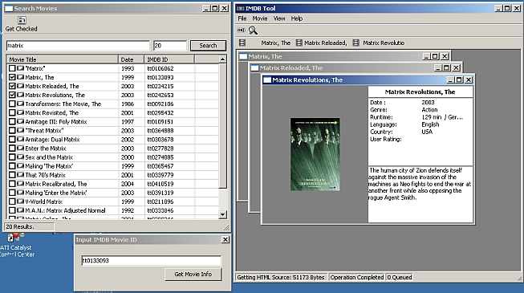



## IMDB Movie info tool UPDATED

### Description

UPDATED, FIXED.. now uses a parse.dat file to change the way the program parses the imdb site, so if they change something, you can just distribute the parse.dat file and not the full app. - - Connect to the Internet movie Database and Download detailed information, and box cover images for your favorite movies. Search for movies by title, Drag and Drop .NFO Files with IMDB Codes inside, Get movie info by IMDB Code. Note: this project is for informational and educational purposes only, I just wanted to see if I could make a GUI type program for a nice website, please support IMDB.com, it is a great service.
 
### More Info
 

             |
---                |---
**Submitted On**   |2004-09-28 22:38:24
**By**             |[Tecc](https://github.com/Planet-Source-Code/PSCIndex/blob/master/ByAuthor/tecc.md)
**Level**          |Advanced
**User Rating**    |4.8 (29 globes from 6 users)
**Compatibility**  |VB 6\.0
**Category**       |[Internet/ HTML](https://github.com/Planet-Source-Code/PSCIndex/blob/master/ByCategory/internet-html__1-34.md)
**World**          |[Visual Basic](https://github.com/Planet-Source-Code/PSCIndex/blob/master/ByWorld/visual-basic.md)
**Archive File**   |[IMDB\_Movie1840511162005\.zip](https://github.com/Planet-Source-Code/tecc-imdb-movie-info-tool-updated__1-58316/archive/master.zip)

